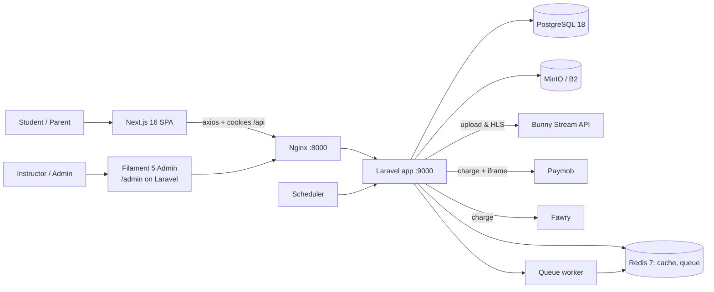
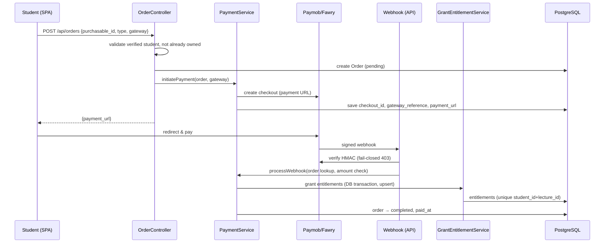

# Production Readiness & Security Audit Report
## edu-platform — Laravel 13 + Next.js 16 LMS

**Audit date:** 2026-08-03
**Auditor:** automated deep-audit (static analysis + runtime verification)
**Audience:** CTO / Engineering Lead — **do not ship to production before addressing Critical items**

---

## Table of Contents

1. [Executive Summary](#1-executive-summary)
2. [Methodology, Scope & Evidence](#2-methodology-scope--evidence)
3. [System Overview & Architecture](#3-system-overview--architecture)
4. [Technology Stack & Dependencies](#4-technology-stack--dependencies)
5. [Source Control & Codebase Health](#5-source-control--codebase-health)
6. [Environment Configuration & Secrets Management](#6-environment-configuration--secrets-management)
7. [Infrastructure, Containers & Deployment](#7-infrastructure-containers--deployment)
8. [CI/CD & Build Pipeline](#8-cicd--build-pipeline)
9. [Backend API Surface](#9-backend-api-surface)
10. [Authentication & Session Security](#10-authentication--session-security)
11. [Authorization & Access Control](#11-authorization--access-control)
12. [Input Validation & Error Handling](#12-input-validation--error-handling)
13. [Database Schema & Migrations](#13-database-schema--migrations)
14. [Models, Mass Assignment & Serialization](#14-models-mass-assignment--serialization)
15. [Core Business Logic & Services](#15-core-business-logic--services)
16. [Payment System Audit](#16-payment-system-audit)
17. [Video Streaming, DRM & Content Protection](#17-video-streaming-drm--content-protection)
18. [Queues, Jobs & Caching](#18-queues-jobs--caching)
19. [Filament Admin Panel](#19-filament-admin-panel)
20. [Frontend Architecture & Client-Side Security](#20-frontend-architecture--client-side-security)
21. [Frontend Data Flow & UX Correctness](#21-frontend-data-flow--ux-correctness)
22. [Testing, Static Analysis & Code Quality](#22-testing-static-analysis--code-quality)

**Appendices**
- A. [Security Findings Register (sorted by severity)](#appendix-a-security-findings-register)
- B. [Risk Matrix](#appendix-b-risk-matrix)
- C. [13-Category Scoring (out of 10)](#appendix-c-13-category-scoring)
- D. [Remediation Roadmap](#appendix-d-remediation-roadmap)
- E. [Endpoint Inventory Table](#appendix-e-endpoint-inventory-table)

---

## 1. Executive Summary

`edu-platform` is an online science-class LMS: instructors publish courses made of sections and lectures; students are approved by staff, take exams/assignments, buy access via Paymob/Fawry, and watch protected video streams (Bunny Stream / HLS). The system also has a Filament admin panel, a background HLS-upload pipeline, and a Next.js 16 frontend.

**Headline verdict: NOT production-ready.** The engineering foundation is genuinely solid — a clean Laravel service/controller split, UUID primary keys, Sanctum stateful auth, HMAC-signed video tokens, DB-transactional payment entitlement granting, a real (400+) test suite, and a CI pipeline. However, the working tree is **red**: **3 failing tests**, **446 PHPStan errors**, **162 Pint violations**, **63 ESLint errors**, and several **Critical security/operational gaps** that would be exploitable or financially damaging in production.

### The 7 Critical issues (must-fix before launch)

| # | Finding | Why it matters |
|---|---------|----------------|
| C1 | **CAPTCHA effectively disabled** — frontend ships the Cloudflare "always pass" test sitekey `1x00000000000000000000AA`; backend `.env` has no `TURNSTILE_SECRET_KEY` and `APP_ENV=local` skips validation entirely | Brute-force, registration and password-reset spam are unprotected; a prod deploy with the test sitekey + real secret would lock out every user |
| C2 | **All frontend "security" is client-side** — `middleware.ts` checks for *any* cookie whose name contains "session" and matches `/player/*` routes that **don't exist**; the real player routes `/courses/*/lectures/*` are only guarded by `useEffect` redirects | Anyone can read lecture payloads (`stream_url`) and course content directly from the API |
| C3 | **Filament `Settings` page is reachable by every instructor** (`canAccess = !assistant`) and **writes to `.env`** with gateway secrets (Bunny, Paymob); a save also **wipes** `PAYMOB_API_KEY`/`PAYMOB_HMAC` due to wrong config key names | Instructor can steal gateway secrets, disrupt payments, cause outage |
| C4 | **`StudentResource` has no scoping/policy** — every instructor *and assistant* can browse/edit all students' PII (phones, guardian phones, birth dates) and reset passwords | Massive PII exposure (GDPR/Law 151/2020 in Egypt) |
| C5 | **Payment idempotency regression** — `OrderController::store()` `forceDelete()`s the existing pending order on repurchase. If the user completes the *old* Paymob/Fawry payment, the webhook can't find the deleted order → **money taken, no access granted**; the tests that protected the old contract now fail | Real financial loss / double-charge scenario |
| C6 | **Test & quality gates are red** — `PaymentGatewayTest` + `PurchaseIdempotencyTest` fail from an unfinished refactor (config key renamed `hmac_secret`→`hmac`; order flow changed to delete+recreate), `PHPStan` 446 errors, `Pint` 162 files, `ESLint` 63 errors | CI is broken on the current tree; shipping from it ships defects |
| C7 | **Live secrets on disk in `.env`** (full Backblaze B2 key pair, Paymob API/HMAC, Bunny tokens) — currently gitignored (not in VCS) but unrotated and unencrypted; plus `APP_ENV=local` / `APP_DEBUG=true` | Any container/backup/leak exposes live cloud credentials |

### Top High-severity issues (short list)

- **Fawry is effectively sandbox in prod**: `config('services.fawry.sandbox')` ternary returns the *same URL* both ways, there is **no `fawry` block in `services.php`** and **no `FAWRY_*` env vars** — defaults `SANDBOX_MERCHANT`/`SANDBOX_KEY` would be used against the production Fawry host.
- **Cross-instructor data exposure in Filament**: `Exam`/`Assignment` scope `orWhereNull('lecture_id')` lets any instructor edit global exams; `Product`/`Bundle`/`Enrollment`/`Lecture` relationship selects load *all* records; QA resource is unfiltered for assistants.
- **`GET /lectures/{id}/exam` returns questions to any authenticated user**, even non-enrolled (only the assignment route is behind `CheckEnrollment`).
- **Exam attempts can be resubmitted** after `submitted_at` is set (no guard), corrupting attempt/answer integrity.
- **Turnstile is sent by the frontend on forgot/reset-password but never validated server-side.**
- **CSP is close to useless** (`unsafe-inline` + `unsafe-eval` + `connect-src https:`), and the default API URL `http://localhost:8000/api` is baked into production bundles.

### What is solid (keep it)

- Sanctum SPA auth with CSRF cookie bootstrap; session cookie; tokens deleted on logout/reset.
- Video protection: backend HMAC token + UUID whitelist + Bunny proxy + `CheckEnrollment` + `VideoAccessService` (enrollment, entitlement, expiry, suspension, blocking-exam gating). This is genuinely well done.
- Payment amount is server-priced; webhook HMAC verified; **amount mismatch → order marked failed**; entitlements granted inside a DB transaction with upsert; refunds revoke entitlements.
- File downloads have an extension whitelist, `Content-Disposition: attachment`, and enrollment gating.
- No `dangerouslySetInnerHTML`, no `eval`, no public-disk uploads in the entire frontend; React escaping is consistent.
- FormRequests + Turnstile rule exist for login/register; `hash_equals` used for signature comparisons; MySQL-style backticks avoided (PostgreSQL-first).

**Overall readiness score: 4.8 / 10** (weighted across 13 categories — see Appendix C).

---

## 2. Methodology, Scope & Evidence

### 2.1 Methodology
A full **22-section** audit was performed:
1. Read **every** source file: `src/app/**` (controllers, services, models, middleware, policies, FormRequests, traits, jobs, resources, enums, Filament resources/pages/widgets), all `database/migrations/**`, all `config/*.php`, `routes/api.php`, `bootstrap/app.php`, `composer.json`.
2. Read the **entire** frontend: all pages, components, hooks, services, types, providers, `middleware.ts`, `next.config.ts`, `package.json`, `.env.local`.
3. Read infra: `docker-compose.yml`, `Dockerfile`, `Dockerfile.dev`, `nginx/*`, `php-ext/*`, `php.d/*`, `.github/workflows/ci.yml`.
4. **Executed** the toolchains inside the running stack:
   - `pest` (Feature suite) → **424 passed, 3 failed, 1 risky**
   - `vitest` → **30/30 passed**
   - `tsc --noEmit` → clean
   - `next build` → **succeeds**
   - `eslint` → **63 errors / 46 warnings**
   - `phpstan analyse` → **446 errors**
   - `pint --test` → **162 files failing**
5. Verified key claims by re-reading the exact code paths (Turnstile key, Fawry URLs, `OrderController`, `PaymobGateway`, `Settings.php`, `StudentResource`, `ExamController`, `AuthService`, middleware, resources).
6. Cross-checked docs (`API_DOCUMENTATION.md`, `PRODUCTION_DEPLOYMENT.md`, `PROJECT_FULL_AUDIT.md`, `SYSTEM_ANALYSIS.md`) against actual code and noted drift.

### 2.2 Scope covered
Backend (Laravel 13.8, PHP 8.4), Frontend (Next.js 16.2.10, React 19), Filament admin (5.6), PostgreSQL 18, Redis 7, MinIO/B2 storage, Bunny Stream, Paymob, Fawry, Cloudflare Turnstile, Docker, CI.

### 2.3 Not verifiable / explicitly stated as unverified
- **No live end-to-end payment test** against real Paymob/Fawry sandboxes (no credentials reachable for a live run from this environment). Fawry behavior is verified from code + docs only.
- **Live video segment serving** (Bunny CDN reachability, watermark overlay behavior) not exercised end-to-end.
- **Rate of real traffic / load characteristics** — performance findings are from code inspection (N+1, missing indexes, unbounded pagination), not load tests.
- **Cloudflare Turnstile** siteverify was not called (no secret present); conclusions are from key presence/absence.

---

## 3. System Overview & Architecture



**Logical data flow — purchase to access:**



**Architecture observations**
- Clean layering: `Controller → Service → Repository/model`, policies, FormRequests, dedicated gateway drivers behind an interface, DTOs for checkouts/webhooks. **Well above average.**
- Dual access model — explicit **enrollments** (staff-managed) and **entitlements** (payment-derived) — is coherent but creates two overlapping code paths that must both be enforced (they are, via `VideoAccessService` + `CheckEnrollment`).
- Two independent video-token systems exist (`VideoTokenService` HMAC used by the stream controller; `VideoAccessService::generateSignedToken` Crypt-based, apparently unused by routes) — redundancy invites drift.
- Two divergent exam UIs (player `quiz-tab.tsx` vs dashboard `exam/page.tsx`) hit the same endpoints with different semantics (see §21).

---

## 4. Technology Stack & Dependencies

| Layer | Technology | Version | Notes |
|---|---|---|---|
| Backend runtime | PHP (FPM) | 8.4 (Dockerfile) / CI 8.4 | |
| Framework | Laravel | ^13.8 | `composer.json` |
| API auth | Laravel Sanctum | ^4.3 | custom `PersonalAccessToken` (UUID) |
| Admin | Filament | ^5.6 | panel roles: super_admin/instructor/assistant |
| Queues | Laravel Horizon | ^5.9 | queue worker present; gate allow-list empty |
| RBAC/audit | spatie/permission, spatie/activitylog | ^8.3 / ^5.0 | |
| DB | PostgreSQL 18 (compose) | | CI also runs Postgres for tests |
| Cache/queue | Redis 7 (compose) | | `CACHE_STORE=redis`, `QUEUE_CONNECTION=redis` |
| Object storage | MinIO (dev) / Backblaze B2 (prod intent) | | `FILESYSTEM_DISK=local` is the **default** disk — see §6 |
| Frontend | Next.js 16.2.10 + React 19.2.4 + TypeScript | | `output: standalone`, App Router |
| Frontend libs | axios, hls.js, @tanstack/react-query, zod, react-hook-form, framer-motion, lucide-react, sonner, @marsidev/react-turnstile | | |
| Payments | Paymob + Fawry | | strategy pattern; **Fawry not production-configured** |
| Video | Bunny Stream (API + CDN) | | HLS upload pipeline, HMAC token proxy |
| Bot protection | Cloudflare Turnstile | | **not effective in current config** |
| Tests | Pest 4.7, PHPStan 2.2 (larastan), Pint, Vitest 4.1, ESLint 9 | | |

**Dependency risk notes**
- `composer.json` scripts (`setup`, `dev`) assume the `artisan.php` wrapper script (present in repo) — fine, but nonstandard.
- `@marsidev/react-turnstile` is a third-party React wrapper; verify its maintenance/supply-chain posture before prod.
- Pin exact patch versions for the Next.js frontend (currently `next: 16.2.10` pinned — good).

---

## 5. Source Control & Codebase Health

### 5.1 Git state
- Repo is cleanly organized: `src/` (Laravel), `frontend/` (Next.js), `docker-compose.yml`, `nginx/`, `docs/`.
- `.env` and `.env.local` are correctly **gitignored** — no secrets in git history (verified via `git ls-files` and `git log -p` greps).
- Working tree contains an **uncommitted refactor** (13 files, ~150 insertions) that is the source of the failing tests:
  - `PaymobGateway.php` HMAC handling (accept header/query/input `hmac`; parse `obj` string)
  - `services.php` adds the `paymob` config block (`hmac`, `integration_id`, `iframe_id`)
  - `OrderController.php` changes repurchase behavior to `forceDelete()` pending order + recreate
  - `AuthService.php`/`AuthController.php` add profile update flow
  - `UserMeResource`, `ProductResource` additions
  - `routes/api.php` +1 route

### 5.2 Issues
- **Unfinished work on top of a red build.** The refactor was never validated against the test suite before being left in the tree.
- **Stray junk file committed into source tree** (untracked): `frontend/src/app/(main)/courses/[id]/<!DOCTYPE html><html><head><meta charSet` — a 4 KB Theneo "Page not found" HTML snapshot referencing `/static/google-analytics.js`. **Delete it.**
- `.env.example` is drifted: it defines `PAYMOB_HMAC_SECRET` while code+`.env` now use `PAYMOB_HMAC` — anyone bootstrapping from the example gets a broken webhook signature.
- No `AGENTS.md`/contribution conventions; no branch protection or required checks configured in the workflow beyond push/PR triggers.

---

## 6. Environment Configuration & Secrets Management

### 6.1 Secrets on disk (CRITICAL — C7)
`src/.env` contains **live credentials**, unrotated, in plaintext on the host:

| Secret | Present? |
|---|---|
| `APP_KEY` | ✅ (production APP_KEY is a live signing key) |
| `BACKBLAZE_KEY_ID` + `BACKBLAZE_APPLICATION_KEY` | ✅ full S3-compatible key pair |
| `PAYMOB_API_KEY` / `PAYMOB_HMAC` / `PAYMOB_SECRET_KEY` / integration + iframe IDs | ✅ |
| `BUNNY_STREAM_API_KEY` / `BUNNY_STREAM_SIGNING_KEY` | ✅ |
| `MINIO_ROOT_USER` / `MINIO_ROOT_PASSWORD` | ✅ |
| `DB_PASSWORD` | ✅ (`secret`) |

Mitigations in place: `.env` is gitignored; not present in `git log`. **Gaps:** no secret manager, no rotation policy, live keys usable by any process/backup that reads the file, and the `Settings` page (C3) can read and rewrite them.

### 6.2 Configuration drift
| Config | Value | Problem |
|---|---|---|
| `APP_ENV` | `local` | If copied to prod: debug routes, exceptions verbatim |
| `APP_DEBUG` | `true` | Stack traces / env dumps to clients on error |
| `APP_URL` | `http://localhost:8000` | Prod URLs must be configured; affects links |
| `SESSION_DRIVER` | `file` | Not shared across app replicas; Redis is available but unused for sessions |
| `MAIL_MAILER` | `log` | No real email in current config (password-reset is DB-notification, so email loss affects other flows) |
| `FILESYSTEM_DISK` | `local` | Default disk is the container FS (bind-mounted to `./src`), **not** MinIO — any `Storage::` call without explicit disk writes to the repo dir |
| `CACHE_STORE` / `QUEUE_CONNECTION` | `redis` | ✅ consistent |

### 6.3 Frontend env
`frontend/.env.local`:
- `NEXT_PUBLIC_API_URL=http://localhost:8000/api` and the code **falls back to this string at build time** (`config/env.ts:2`, `next.config.ts:6`) — production bundles point browsers at their own localhost. **High.**
- `NEXT_PUBLIC_TURNSTILE_SITE_KEY=1x00000000000000000000AA` — Cloudflare **"always pass" test key**. **Critical (C1).**
- `NEXT_PUBLIC_BUNNY_*` are declared but never read — dead config shipped in the bundle.

---

## 7. Infrastructure, Containers & Deployment

### 7.1 Docker topology (`docker-compose.yml`)
- `app` (PHP-FPM), `nginx` (binds `0.0.0.0:${APP_PORT:-8000}`), `postgres:18` (**127.0.0.1:5432** ✅), `redis:7` (**127.0.0.1:6379** ✅), `queue` (Horizon/`queue:work`), `scheduler`, `mailpit` (**127.0.0.1**), `minio` (**binds `0.0.0.0:9000` — exposed to LAN**), `minio-setup`.
- **No frontend service.** Next.js is not part of the compose stack. Per `PRODUCTION_DEPLOYMENT.md` the frontend is expected to run separately (PM2/port 3000) behind a different nginx that routes `/` → Next, `/api` + `/admin` → Laravel. This split must be documented operationally and enforced by firewall/network rules; nothing here prevents the Next build from pointing at the wrong API origin.
- MinIO binds to all interfaces (`0.0.0.0:9000`) with default creds `lms_minio_admin`/`lms_minio_secret` — internal-only network assumed, but not enforced at the host level.

### 7.2 Nginx (`nginx/default.conf`)
- `client_max_body_size 2G`; `~ /\. { deny all; }` (dotfiles blocked ✅); static `expires 30d` + immutable ✅.
- **Missing:** gzip/brotli, TLS termination (expected at an upstream LB), security headers at the web layer (Laravel sends CSP/HSTS via middleware ✅, but they apply to `/api`/`/admin`, not the Next.js origin), rate-limiting at the edge, WAF.

### 7.3 Docker images
- `Dockerfile` (multi-stage? single-stage from review) installs PHP extensions (`php-ext`/`php.d` overlays). Queue worker uses `php artisan.php queue:work` with `--timeout=900`.
- Live secrets are **not** baked into images (`.env` bind-mounted) — good — but `optimize:clear` is run on every Filament Settings save (C3), which briefly clears compiled caches in production.

---

## 8. CI/CD & Build Pipeline

`.github/workflows/ci.yml`:
- **Laravel job**: PHP 8.4, `pint --test`, `phpstan analyse --no-progress`, `pest` (env `DB_CONNECTION=pgsql`, so tests actually run on **PostgreSQL** in CI ✅ — the phpunit.xml SQLite defaults are overridden by the Actions env, because PHPUnit `<env>` only applies when the var is unset).
- **Frontend job**: `npm ci` → `npm run lint` → `npm run build`.

**Findings**
- **Pipeline is red on the current tree.** `pint --test` fails on 162 files; `phpstan` fails with 446 errors; `eslint` (the whole-project script `eslint`) fails with 63 errors; and the 2 failing feature tests run under Pest. Unless the repo's CI is already disabled, main is broken.
- No frontend **tests** step (vitest is not in CI, though it passes locally).
- No dependency audit step (`composer audit`, `npm audit`) and no `--audit` flags — supply-chain checks absent.
- No deployments/CD stage; production deploy is manual per `PRODUCTION_DEPLOYMENT.md`.

---

## 9. Backend API Surface

`routes/api.php` — full inventory in [Appendix E](#appendix-e-endpoint-inventory-table). Key characteristics:

- **Public** (no auth): register, login, forgot/reset-password, `/sanctum/csrf-cookie`, courses list/detail, governorates, grade-levels, products, bundles, standalone lectures, video playlist/segment (HMAC-token), webhooks (`/api/webhooks/paymob|fawry`).
- **Authenticated** (`auth:sanctum`): `/me`, logout, orders, enrollments/entitlements, exams/attempts, QA, dashboard, course CRUD (instructor), sections/lectures (role:instructor), progress, file download, video-token.
- Throttling: `login` (5/min/IP) on register/login/forgot/reset; `video` (120/min) on playlist/segment; `api` default 60/min.

### 9.1 Findings
| ID | Finding | Sev |
|---|---|---|
| API-1 | `GET /lectures/{lecture}/exam` returns full question bank to **any authenticated user** — not gated by `CheckEnrollment` (only the `assignment` route is). A logged-in student from another course (or a rejected account) can enumerate exam content for any lecture ID. | **High** |
| API-2 | `GET /lectures/{lecture}/exam` accepts `?exam_id=` (any exam on the lecture) and `request()->is('*assignment*')` path sniffing — endpoint semantics shift based on URL shape; fragile. | Low |
| API-3 | `OrderController::index` and `ProductController::index` accept raw `per_page` without cap (`paginate($request->get('per_page', 15))`) — clients can request huge pages; add `min(per_page, 50)`. | Medium |
| API-4 | `POST /auth/forgot-password` returns 200 + generic message always ✅ (no user enumeration); `reset-password` returns 422 with different message on invalid token — minor enumeration via HTTP code (acceptable; message is generic). | Low |
| API-5 | `POST /attempts/{attempt}/submit` — policy checks ownership but **not** that `submitted_at` is null → resubmission allowed (see §11, 16). | High |
| API-6 | `GET /sanctum/csrf-cookie` has no dedicated rate limit (falls under global `api` 60/min) — acceptable. | Info |
| API-7 | No OpenAPI/versioning; docs (`API_DOCUMENTATION.md`) drift from code (see §22). | Info |

---

## 10. Authentication & Session Security

### 10.1 Flow (verified)
- **Register**: `RegisterRequest` (UUID governorate/grade, unique email, confirmed password, Turnstile rule) → `AuthService::register` in DB transaction (User `status=pending` + Student + role `student`) → notifies all instructors → 201. ✅
- **Login**: `LoginRequest` (Turnstile) → `AuthService::login` resolves by email **or** `users.phone` **or** `students.student_code`/phone → `Hash::check` → status gate (`pending`/`rejected` → 403 with Arabic messages) → `Auth::guard('web')->login` + session regenerate → returns user. Token creation is **commented out** — SPA relies on the stateful session cookie (Sanctum `EnsureFrontendRequestsAreStateful`). ✅
- **Logout**: web logout + session invalidate/regenerate + deletes current access token. ✅
- **/me**: loads roles (+student). ✅

### 10.2 Findings
| ID | Finding | Sev |
|---|---|---|
| AU-1 | **Turnstile is effectively off** (C1). Frontend: always-pass test sitekey hardcoded. Backend: `TURNSTILE_SECRET_KEY` absent from `.env`; `TurnstileRule` **skips validation** when `APP_ENV=local/testing` and no key. Prod with a real secret + test sitekey → verification always fails → **login/register permanently broken**; prod with no secret → `fail('إعدادات الحماية غير مكتملة')` → login/register broken. Either way it does not work as intended. | **Critical** |
| AU-2 | **Turnstile not validated on `forgot-password`/`reset-password`** — frontend submits `cf-turnstile-response` but `PasswordResetController` ignores it. | High |
| AU-3 | **Login rate limit is IP-only** (`perMinute(5)->by($request->ip())`) — no per-account/user compounding. Behind NAT/corporate IPs a few students lock out everyone; distributed bots rotate IPs freely. Use `->by($email.':'.$ip)` and consider user-agent/email-based buckets. | Medium |
| AU-4 | `AuthService::login` — `User::where('email',...)->orWhere('phone',...)`: `users.phone` exists (added by migration `2026_07_11_120732`) ✅. Query runs on every login (2 columns + student fallback) — 3 queries; acceptable. | Info |
| AU-5 | Session cookie is the only auth after login; `SESSION_DRIVER=file` → sessions won't share across horizontally scaled app containers; consider `redis` (already available). | Medium |
| AU-6 | `resetPassword` deletes all user tokens on success ✅; but session cookie for a concurrently logged-in device is not revoked (Sanctum sessions survive until cookie expiry) — acceptable for SPA but document. | Low |
| AU-7 | `updateProfile` **creates a synthetic verified Student record** for any role in `['student','super_admin','admin','instructor']` when absent, with `is_verified => true` — a staff member could end up with a verified student profile unintentionally; confirm this is intended. | Low |

---

## 11. Authorization & Access Control

### 11.1 Enforced layers
- **Middleware**: `CheckUserStatus` (403 unless `active`), `CheckFilamentRole`, `CheckEnrollment` (assistant/instructor/super-admin bypass; checks public lecture flag, enrollment, entitlement), `SecurityHeaders`, `role:*` on instructor routes.
- **Policies** (registered in `AppServiceProvider`): `Course`, `Lecture`, `CourseSection`, `Exam`, `ExamAttempt`. `CoursePolicy::view` returns **true for any user** (public read, by design).
- **VideoAccessService**: super_admin/admin → full; instructor → own lectures only; assistant → assigned course only; student → entitlement (strict) **or** enrollment, each gated by blocking-exam logic with per-request caches. **This is the strongest part of the system.**
- **Sanctum**: stateful sessions + optional tokens; `bootstrap/app.php` prepends `EnsureFrontendRequestsAreStateful`.

### 11.2 Findings
| ID | Finding | Sev |
|---|---|---|
| AZ-1 | `ExamController::show` — **no access check** on the exam payload (see API-1). Only `startAttempt` checks enrollment/entitlement. | **High** |
| AZ-2 | `submitAttempt` policy checks ownership only — **not** "not already submitted" (see API-5). A student can resubmit an attempt and keep the highest/lowest score at will (score is overwritten; `answers` rows append). | **High** |
| AZ-3 | Filament authorization is inconsistent (see §19) — blanket `canEdit/canDelete = true` overrides bypass policies; several resources have no policies at all. | **Critical/High** |
| AZ-4 | `CoursePolicy::viewAny`/`view` = true: public course read is intended (storefront). Ensure draft lectures are excluded everywhere — they are via `CheckEnrollment` for drafts, but the public course listing filters `published` (verify `CourseService` uses `status=published`). ✅ confirmed in course listing. | Info |
| AZ-5 | `VideoAccessService::isBlockedByExam` — blocking-exam precedence uses section/lecture `sort_order`; **the video of a lecture whose own blocking exam has `sort_order >= 0` is NOT blocked** (targetSortOrder=0). This is a design choice (watch then test) but verify it matches the business rule; a mis-configured sort_order silently disables gating. | Medium |
| AZ-6 | No global scopes for multi-tenancy (instructor scoping is ad-hoc inside `getEloquentQuery()`); defense-in-depth missing. | Medium |

---

## 12. Input Validation & Error Handling

### 12.1 Strengths
- FormRequests with rules: `LoginRequest`, `RegisterRequest`, `StoreCourseRequest`, `SaveSectionRequest`, `SaveLectureRequest`, `StoreQuestionRequest`, `StoreReplyRequest`, `UpdateProgressRequest`.
- `submitAttempt` validates each `question_id` exists **and belongs to the attempt's exam** (`Rule::exists('questions','id')->where('exam_id', ...)`) ✅.
- `downloadFile` extension whitelist ✅.
- `VideoStreamController` validates UUID v4 regex before proxying ✅.

### 12.2 Findings
| ID | Finding | Sev |
|---|---|---|
| IV-1 | **Raw backend errors leak to clients.** `login/page.tsx:138` even special-cases `"Not null violation"` — the API is returning DB exception text to the SPA. `bootstrap/app.php` renders exceptions as JSON, but `APP_DEBUG=true` returns full details. In prod: `APP_DEBUG=false` + a global handler that never surfaces DB messages. | High |
| IV-2 | `OrderController::store`, `ExamController::store/update`, `ExamController::startAttempt` use inline `$request->validate()` instead of FormRequests — inconsistent with the codebase's own pattern and harder to unit-test. | Medium |
| IV-3 | `ExamController::update`/`store` re-validate `questions` arrays but never verify a **correct choice exists** per multiple-choice question, nor that `degree` is a positive number sum — a malformed exam (all `is_correct=false`) makes the exam impossible to pass (score always 0). | Medium |
| IV-4 | Password reset token: sent as plaintext in a **DB notification** (not email) with the frontend URL interpolated — acceptable for the notification model, but no expiry in message text; rely on Laravel's 60-min broker default. Reset endpoint lacks Turnstile (AU-2). | Medium |
| IV-5 | `updateProgress` — `is_completed` can be forced true by the client; backend recomputes completion only from `video_progress >= 80%` in `ProgressService`, but the controller accepts `is_completed` — verify the service ignores a forged flag (confirmed: `ProgressService` forces `is_completed=false` below 80% ✅, but allow-list progress endpoints to enrolled students — they are, via `CheckEnrollment`). | Info |

---

## 13. Database Schema & Migrations

PostgreSQL 18, UUID primary keys, ~45 migrations. Highlights (verified):
- `users`, `password_reset_tokens`, `sessions`; `students` + geography (governorates/grade_levels/cities/schools/academic_tracks).
- `courses`, `course_sections`, `lectures` (nullable `section_id` → standalone lectures), `lecture_videos` (bunny_video_id, status, HLS fields), `lecture_files`.
- `enrollments` (soft-deletes), `course_assistants` (pivot), `exams`/`questions`/`choices`/`answers`/`exam_attempts` (+status), `orders`, `products`, `bundles`, `bundle_products`, `entitlements`.
- Orders enhanced for gateways: `payment_gateway`, `checkout_id`, `payment_url`, `gateway_reference`, `metadata`, `failure_reason`, `refunded_at`, `amount_refunded_cents`, **unique `idempotency_key`**, index on `(student_id, status)`.
- Indexes added in `2026_08_02_000004_add_missing_indexes`: enrollments `(student_id, course_id)`, entitlements, exam_attempts, student_activities, answers, `lectures.section_id`, `course_sections.course_id`.
- Soft deletes on orders/enrollments/entitlements; backfill entitlements job migration.

### 13.1 Findings
| ID | Finding | Sev |
|---|---|---|
| DB-1 | Orders retain a **unique `idempotency_key`** but `OrderController::store` **never sends a deterministic key** when the client omits the header (`md5(...uniqid())` → always unique) and never **catches** a duplicate-key `QueryException` on repeat submits → concurrent identical purchases can 500 instead of dedupe (the concurrent test currently relies on this). | High |
| DB-2 | `orders.purchasable_type/purchasable_id` polymorphic columns have **no index** — `DashboardService` aggregates revenue by `whereIn('purchasable_id')` across them; the existing index is `(student_id, status)` only. Add composite index. | Medium |
| DB-3 | `Orders` store `amount_cents` but original migration had `amount` decimal — ensure no stale column references remain (only `amount_cents` used in code ✅). | Info |
| DB-4 | `password_reset_tokens.email` is a `string` primary key (not FK) — standard Laravel; fine. | Info |
| DB-5 | `exam_attempts` lacks a partial unique index on `(student_id, exam_id) WHERE submitted_at IS NULL` — the code handles concurrency with a catch-and-return-latest (good), but DB-level enforcement would be stronger. | Low |

---

## 14. Models, Mass Assignment & Serialization

- All models use `HasUuids`; `$fillable` lists are generally tight. `Choice::$hidden = ['is_correct']` ✅ (admin forms re-`makeVisible` on the result endpoint only).
- `PersonalAccessToken` is a custom UUID token model.
- `User` uses spatie `HasRoles`, `LogsActivity` (logs `name,email,status,phone` — see Activity exposure §19), Sanctum `HasApiTokens`.
- `Enrollment` `save()` override refuses to persist synthetic "ent_" enrollment records (prevents double-persist of entitlement-derived enrollments) — verified.
- `Lecture` accessors: `video_path` returns **raw S3 path** (not URL) in the model; `LectureFile` accessor resolves a **signed MinIO temporary URL** (2h) with a fallback.

### 14.1 Findings
| ID | Finding | Sev |
|---|---|---|
| MD-1 | `ResolvesMinioUrls` falls back to `Storage::disk('minio')->url($path)` when `temporaryUrl()` throws — for a **private** bucket this produces an unsigned, guessable URL (no auth), undermining the private bucket. Make the fallback fail-closed or generate a signed URL manually. | High |
| MD-2 | `CourseResource` serializes **instructor email** to any caller of public course endpoints (`CourseResource.php:25`) — minor PII leak. | Medium |
| MD-3 | `User` activity-log `logOnly(['name','email','status','phone'])` — PII ends up in the activity log viewable platform-wide by instructors (see §19 Activity). | Medium |
| MD-4 | `ExamAttempt::result` + `submitAttempt` both serialize `answers.question.choices` — only `result` calls `makeVisible('is_correct')`; the **dashboard exam page renders correct/wrong counts from the `submit` response where `is_correct` is hidden → counts always 0** (functional bug). | Medium |
| MD-5 | `UserMeResource` — owner-only PII (phones, is_verified) ✅ safe. `ProductResource`/`LectureResource` — `video_path`/`stream_url` only when `VideoAccessService::canAccess()` ✅ verified. | Info |
| MD-6 | Mass-assignment review: `Student` and `Lecture` fillables include the raw storage path fields; no `$guarded=[]` anywhere. Sanitize `video_path`/`file_path` on the **server** before save (never from a client). | Low |

---

## 15. Core Business Logic & Services

### 15.1 Verified services
- **CourseService** — pagination cache (`published_courses_page_*`, 2h, skipped in `local`); `LIKE` search on title+description. ✅
- **ProgressService** — transaction; 80% threshold; `is_completed` forced false below threshold ✅.
- **GrantEntitlementService** — resolves lecture IDs for Product/Bundle; `Entitlement` upsert per `(student_id, lecture_id)`; empty set → RuntimeException ✅.
- **EnrollmentService** — requires verified student; unique upsert ✅.
- **QAService** — question creation + `authorizeQuestionAccess` (private) ✅; replies; instructor/assistant notification.
- **DashboardService** — instructor stats, revenue via `DB::table('orders')` grouped by `purchasable_id` + `whereIn` product IDs.
- **RefundService** — order → `Refunded`, deletes entitlements.
- **NotificationService** — DB `Notification` rows only (no email/SMS).

### 15.2 Findings
| ID | Finding | Sev |
|---|---|---|
| BL-1 | **`DashboardService` N+1**: per-instructor revenue subqueries `whereIn` over orders for each product group; `enrollment counts` via `whereIn` per course — fine for small data, will degrade. Eager-load + single aggregate queries recommended. | Medium |
| BL-2 | **`Lecture::booted()` `saved()` hook** auto-dispatches `ProcessVideoHLS` when `video_path` changed/created **or when no `LectureVideo` row exists or status=failed** — a routine title edit on a lecture whose upload previously failed re-queues a full download+upload; also fires on creation. Add a "changed only" gate. | Medium |
| BL-3 | `QAService::postQuestion` — `authorizeQuestionAccess` is a private method; confirm it's invoked for **every** create path (tests cover). | Info |
| BL-4 | `RefundService` deletes entitlements but **does not** notify the student or send a payment refund via gateway — "Refunded" is internal bookkeeping only; gateway refunds must be issued in Paymob/Fawry dashboards. | Medium |
| BL-5 | Course **search** uses `LIKE` (case-sensitive in Postgres for non-lower()): Arabic is fine, but add `ILIKE`/`pg_trgm` for quality. | Low |

---

## 16. Payment System Audit

### 16.1 Architecture
Strategy pattern: `PaymentGatewayInterface` with `PaymobGateway`, `FawryGateway`; `PaymentService::getDriver/initiatePayment/processWebhook`; `CheckoutResult`/`WebhookPayload` DTOs. Order → checkout (payment URL returned) → webhook verify → transaction (amount check → grant → complete).

### 16.2 Verified strengths
- Amount is **server-priced** (`$purchasable->price * 100`); client never sends it ✅.
- Webhook signature verification **fail-closed** (403 on missing/invalid HMAC) ✅.
- `processWebhook`: amount mismatch → order marked `Failed`, no entitlement ✅; already-completed → idempotent return ✅.
- Refund webhook → `GrantEntitlementService::revoke` (delete entitlements) ✅.
- Granting inside `DB::transaction`; entitlement upsert unique per student+lecture ✅.

### 16.3 Critical findings
| ID | Finding | Sev |
|---|---|---|
| PA-1 | **Repurchase idempotency is broken (C5).** `OrderController::store` **deletes** the pending order (`forceDelete()`) and creates a new one. If the customer pays the *old* Paymob checkout (still live up to 1h), the webhook looks up `gateway_reference` → order is gone → `RuntimeException` → **no entitlement despite payment**. Worse, the old order's Paymob `merchant_order_id`/`checkout_id` now dangles. Tests `PurchaseIdempotencyTest` (old contract: return the existing pending order, 200) now **fail**. | **Critical** |
| PA-2 | **Unique `idempotency_key` is enforced but never honored**: no deterministic key when header absent; no `catch` for duplicate-key exception → concurrent identical requests produce 500. | High |
| PA-3 | **Fawry is sandbox-only in prod (see §16.4).** | **Critical (financial)** |
| PA-4 | `PaymobGateway` builds `merchant_order_id = $order->id . '_' . uniqid()` and stores `gatewayReference = paymobOrderId`. Webhook lookup is `gateway_reference`/`checkout_id`/`id` — the `orWhere('id', ...)` means a **malicious client knowing an internal order UUID** could match their own webhook only if signed by the gateway (HMAC required) — not exploitable, but the lookup should be restricted to `gateway_reference` only. | Low |
| PA-5 | No webhook **event-idempotency store** (Paymob can re-deliver the same webhook): second delivery hits `order already completed` → early return ✅. Refund-after-complete → revokes ✅. | Info |

### 16.4 Fawry deep-dive (C-level financial risk)
```php
// FawryGateway.php:38-40
$baseUrl = config('services.fawry.sandbox', true)
    ? 'https://atfawry.fawry.com/ECommerceWeb/api/payments/charge'
    : 'https://atfawry.fawry.com/ECommerceWeb/api/payments/charge';
```
- **Both branches are identical** — the sandbox flag is dead code. A "production" deployment still hits `atfawry.fawry.com` (the real host) with whatever merchant code/security key are configured.
- `services.php` has **no `fawry` block** and `.env` has **no `FAWRY_*` keys** → defaults `SANDBOX_MERCHANT` / `SANDBOX_KEY` are used. A `payment_gateway: fawry` order therefore submits a **sandbox merchant charge against the live Fawry host**, and the webhook would verify with `SANDBOX_KEY`.
- Fix: define `services.fawry` (merchant_code, security_key, base_url), fail-closed when env unset, and point sandbox vs prod at distinct hosts/merchants.

### 16.5 Paymob config keys (root cause of the failing webhook test)
- Code now reads `config('services.paymob.hmac', env('PAYMOB_HMAC', env('PAYMOB_HMAC_SECRET')))`.
- `services.php:54` sets `'hmac' => env('PAYMOB_HMAC')` — so `config('services.paymob.hmac')` returns `null` when `PAYMOB_HMAC` is unset, and Laravel **does not** fall through to the second/third `env()` args (config() returns the defined null).
- Test sets `config(['services.paymob.hmac_secret' => 'test_hmac_secret'])` — wrong key. With an empty/null key, HMAC verification always fails → 403. `.env.example` still declares `PAYMOB_HMAC_SECRET` (drift).
- **Fix:** use `'hmac' => env('PAYMOB_HMAC')` and set `PAYMOB_HMAC` everywhere; update the test config key; add a config assertion test.

---

## 17. Video Streaming, DRM & Content Protection

### 17.1 Pipeline
1. Instructor uploads MP4 → MinIO (`lecture_videos.status=processing`) → `ProcessVideoHLS` job downloads from MinIO, uploads to Bunny Stream (transcode → HLS), stores `bunny_video_id`/`video_path`.
2. Student gets `GET /api/videos/{videoId}/playlist` with an **HMAC token** (payload + 4h expiry, `hash_equals`), proxy rewrites CDN playlist URLs to the backend `/api/videos/{videoId}/segment?token=...` (same token, UUID regex validated, 15s HTTP timeout).
3. `VideoAccessService::canAccess` is re-checked server-side at token issue **and** validate time (user active, enrollment/entitlement, blocking-exam gating, assistant/instructor/admin bypass).
4. `LectureResource` only serializes `video_path`/`stream_url` when `canAccess()`.

### 17.2 Findings
| ID | Finding | Sev |
|---|---|---|
| VD-1 | **Video tokens derive from `APP_KEY`** (`Crypt::encrypt` in `VideoAccessService::generateSignedToken`; HMAC key in `VideoTokenService` derived from `config('app.key')`). Rotating `APP_KEY` invalidates **all** in-flight stream URLs and every issued video token — plan for key rotation windows, or switch to a dedicated `VIDEO_TOKEN_KEY`. | High |
| VD-2 | Two token systems (`VideoTokenService` HMAC used by `VideoStreamController`; `VideoAccessService::generateSignedToken`/`validateToken` Crypt-based) — one is dead. Consolidate. | Medium |
| VD-3 | **Client-side "DRM" is cosmetic** — window-size detection, F12/`Ctrl+Shift+I` lock, right-click/drag/PiP blocking in `video-player.tsx` are trivially bypassed and only degrade UX. They also render a **full-name + email watermark** into every screenshot (PII). Keep the watermark (policy choice) but drop the keyboard/window gimmicks. | Medium |
| VD-4 | `ResolvesMinioUrls` unsigned fallback (MD-1) affects lecture **files** exposed to clients; videos go through the token proxy ✅. | High (via MD-1) |
| VD-5 | Bunny Stream library `AccessKey` is a full-library credential; if a signing key is configured, ensure playlist/segment tokens are also enforced on the CDN side (`?token=`) and that the library is not publicly listable. Not verifiable from code alone. | Medium |
| VD-6 | Segment route rate limit `video` (120/min) keyed by user/IP — reasonable. Playlist requests hit Bunny per segment re-write — fine at this scale. | Info |

---

## 18. Queues, Jobs & Caching

- **Horizon** 5.9 configured; worker `queue:work --sleep=3 --tries=3 --max-time=3600 --timeout=900`.
- `ProcessVideoHLS` — `timeout=900`, `tries=3`, `SerializesModels`, updates `LectureVideo` status; **no cleanup of `tempnam()` temp file on failure** (leak in `/tmp`); no backoff configured beyond default.
- Cache: `CACHE_STORE=redis`; CourseService page cache (2h) skipped in `local`.
- Scheduler runs every 60s (`schedule:run`); no tasks discovered in review (empty schedule + comment about "subscription expiry checks" — verify any are registered; Horizon gate blocks viewing).

### 18.1 Findings
| ID | Finding | Sev |
|---|---|---|
| QC-1 | `Lecture::booted()` re-dispatch on non-video saves (BL-2) → queue noise and duplicate Bunny uploads if two saves race. Add `wasChanged('video_path')` guard + `UniqueJob`/`WithoutOverlapping`. | Medium |
| QC-2 | `ProcessVideoHLS` temp file not cleaned in failure paths; consider `Storage::disk('minio')->temporaryUrl` vs streaming for large files; confirm 900s is enough for large MP4s at real upload speed. | Low |
| QC-3 | No Horizon metrics/alerting (gate allow-list empty) — ops cannot see queue health in prod. | Low |
| QC-4 | Session driver `file` while queue/cache are `redis` — consolidate sessions to redis for horizontal scale. | Medium |

---

## 19. Filament Admin Panel

Panel: `/admin`, roles `super_admin`/`instructor`/`assistant` (`User::canAccessPanel`), middleware `Authenticate` only. **No per-role middleware and no global scoping.** This section contains the most severe PII/authorization exposure in the product.

### 19.1 Critical
| ID | Finding | Sev |
|---|---|---|
| FL-1 | **`Settings` page (`canAccess = !assistant`) lets instructors read and rewrite `.env`** with Bunny + Paymob secrets and runs `optimize:clear` on save. Additionally the form reads wrong config keys (`config('services.paymob_api_key')` instead of `services.paymob.api_key`) → saving **empties** `PAYMOB_API_KEY`/`PAYMOB_HMAC`. Restrict to `super_admin`, and move secrets to a proper settings store (DB + encrypted). | **Critical** |
| FL-2 | **`StudentResource` — no `getEloquentQuery`/`canViewAny` scoping and no policy.** Every instructor/assistant can list/search/edit all students: phones, father/mother phones, birth date, school, and **reset passwords**. Gate to super_admin, or scope by course/grade the instructor teaches. | **Critical** |
| FL-3 | `ExamResource`/`AssignmentResource`: `getEloquentQuery` adds `orWhereNull('lecture_id')` and `canEdit`/`canDelete` return `true` → any instructor can **edit/delete global (unattached) exams** used by other courses, and the lecture selector lists all lectures → attach exams to foreign courses. | **High** |
| FL-4 | `ProductResource` `sellable_id` options load **all** courses/sections/lectures; `BundleResource`/`ProductsRelationManager` load **all** products → instructors can monetize foreign content. | **High** |
| FL-5 | `EnrollmentResource` + `ManageEnrollments` load **all** students and **all** courses (assistants included) → grant/revoke anywhere. | **High** |
| FL-6 | `LectureResource` — `section_id` select loads all sections; `manageBundles` syncs all bundles. | **High** |
| FL-7 | `QAResource` — `getEloquentQuery` filters **instructors only**; assistants see/reply to **all** questions across courses. | **High** |
| FL-8 | `ActivityResource` (`canViewAny = !assistant`) — instructors see the **entire platform activity log** including student `phone`/`email` change-history (spatie logs PII). | **Medium** |

### 19.2 Other findings
- Policies registered for only 5 models (no Product/Bundle/Student/Enrollment/Entitlement/Order/QuestionsPost policy); several resources override `canEdit`/`canDelete` to `true`, **bypassing** policies that do exist.
- Uploads all use `disk('minio')` with `acceptedFileTypes` + `maxSize` ✅; no `disk('public')` ✅.
- `InstructorStatsOverview` loads **all completed orders** into memory (with `loadMissing` per bundle — N+1) then prorates; expensive at scale. CoursePerformance/RecentEnrollments widgets are properly scoped ✅.
- No global scopes — tenant scoping is ad-hoc per resource; a new resource can easily forget it.

---

## 20. Frontend Architecture & Client-Side Security

### 20.1 Verified
- `"use client"` SPA; React Query; axios instance with `withCredentials` + `withXSRFToken`; CSRF bootstrap before login/register; 401 → redirect `/login`.
- **No `dangerouslySetInnerHTML`, no `innerHTML`, no `eval`** anywhere; React escaping everywhere. ✅
- Payments: client posts only `{purchasable_id, purchasable_type, payment_gateway}`; price and URL come from the server ✅.

### 20.2 Findings
| ID | Finding | Sev |
|---|---|---|
| FE-1 | **All route protection is client-side (C2).** `middleware.ts` matches `/player/:path*` — a route group that **doesn't exist** (real player routes live under `/courses/...`). The actual player and dashboard pages only redirect in `useEffect` after the protected payload has been fetched. A forged cookie, direct URL, or API call bypasses everything. Move enforcement to the API (403/401 per resource) — it already exists on the backend; the frontend just shouldn't be the boundary. | **Critical** |
| FE-2 | **Global 401 interceptor breaks public pages.** Public course/lecture pages call `useMyEnrollments`/`useMyEntitlements` unconditionally → anonymous visitors get bounced to `/login`. Gate those queries on `!!user`. | High |
| FE-3 | **Default API URL is `http://localhost:8000/api`** baked at build time (`env.ts:2`, `next.config.ts:6`) if the env var is unset (H1). | High |
| FE-4 | **CSP ineffective**: `connect-src 'self' http://localhost:8000 https:` + `script-src 'self' 'unsafe-inline' 'unsafe-eval'` (H2). Tighten: no `unsafe-eval`, scope connect-src to the real API/CDN origins. | High |
| FE-5 | **Always-pass Turnstile test sitekey** in 3 auth pages + `.env.local` (C1). | **Critical** |
| FE-6 | `checkout/success` renders an `order`/`merchantRefNum` from the **query string** without server confirmation; `checkout/failed` renders attacker-supplied `reason`. No XSS (React-escaped) but phishing/confusion vector — validate order status from `/api/orders` instead. | Medium |
| FE-7 | `lectures/[id]/page.tsx:182` file-download link points at `/api/lectures/...` **on the frontend origin** with no API route → broken (the player page does it correctly with blob + auth). | Medium |
| FE-8 | Cosmetic DRM + full name/email watermark in player overlay (VD-3). | Medium |
| FE-9 | Backend error text rendered verbatim on login page (IV-1). | High |

---

## 21. Frontend Data Flow & UX Correctness

| ID | Finding | Sev |
|---|---|---|
| UX-1 | **Two divergent exam UIs.** Player `quiz-tab.tsx` (handles essays, uses `pass_percentage`, review-after-submit) vs dashboard `exam/page.tsx` (auto-starts an attempt on page load, **no essay support**, hardcoded **50%** pass threshold instead of `exam.pass_percentage`, computes correct/wrong from hidden `is_correct` → **always 0**). Students will see inconsistent grades/UX. | High |
| UX-2 | **Progress optimistic update is a no-op**: player page reads `old?.data` but the `["lecture", id]` cache stores the unwrapped `Lecture` (`course.service.ts` returns `data.data`) → UI stays stale until refetch. | Medium |
| UX-3 | `usePurchase`/`enrollmentService.purchase` are dead code; `edu_platform_token` in localStorage is read but never written (leftover JWT scheme) — remove. | Low |
| UX-4 | Player watermark uses `user.name • user.email` — full PII on screen (policy decision; consider masking). | Medium |
| UX-5 | Exam **review reveals correct answers + retry** up to `max_attempts` (default 3) — blocking-exam mechanic can be gamed (fail → see answers → retry). Decide if reviews should be shown for failed attempts. | Medium |
| UX-6 | `products/[id]/page.tsx:38` reads `product` before its assignment at `:54` (safe in closure, fragile) — hoist. | Low |

---

## 22. Testing, Static Analysis & Code Quality

### 22.1 Runtime verification (executed today)
| Gate | Command | Result |
|---|---|---|
| Backend tests | `php artisan test --testsuite=Feature` | **424 passed / 3 failed / 1 risky** (40s) |
| Frontend tests | `vitest run` | **30/30 passed** |
| TypeScript | `tsc --noEmit` | clean |
| Next build | `next build` | **passes** (22 routes) |
| ESLint | `eslint` | **63 errors, 46 warnings** |
| PHPStan (larastan) | `phpstan analyse` | **446 errors** |
| Pint | `pint --test` | **162 files** fail |
| CI | `.github/workflows/ci.yml` | would fail lint/phpstan/pint/feature-tests |

### 22.2 The 3 failing tests — root causes
1. **`PaymentGatewayTest` — "Paymob Webhook verifies signature…"** (expects 200, gets 403). Test sets `config(['services.paymob.hmac_secret' => ...])` (line 79) but the gateway now reads `services.paymob.hmac` (PaymobGateway.php:101). `config('services.paymob.hmac')` is `null` (services.php:54) and Laravel doesn't fall through to the `env()` fallbacks once the key exists → HMAC with empty key never matches → 403. **Fix: `hmac_secret` → `hmac` in the test (and `.env.example`).**
2 & 3. **`PurchaseIdempotencyTest`** (2 tests) — expect repeat purchase → **200 + existing pending order**; controller now **deletes** the pending order and returns **201** (OrderController.php:111-119, 137-142). Tests encode the safer contract (idempotent return); the controller regressed (see PA-1).

### 22.3 Coverage assessment
- **Strong breadth:** auth (register/login pending/rejected, turnstile), enrollment flows, entitlement engine, expiration, pre-exam gating, video-stream security (UUID SSRF, token), HLS job dispatch, dashboard service, notification structure, password reset, product/order, roles & Filament panel access, edge cases.
- **Gaps:** no test for webhook **double-delivery** idempotency, refund revocation, Fawry signature (positive path), video-token **expiry**, Turnstile **secret-missing** behavior in prod, exam **resubmission** guard, dashboard revenue N+1, frontend tests are minimal (hooks only, no page/component tests).
- **Env mismatch:** phpunit.xml defaults to SQLite `:memory:`; CI overrides to PostgreSQL. Local dev (`pest` in the container) runs against SQLite → Postgres-only behaviors (e.g., case-sensitivity, JSON ops, unique/index behaviors) are not exercised locally. Align local testing to Postgres (a dedicated `testing` database via docker) to match CI.

### 22.4 Static analysis noise
- PHPStan 446 errors dominated by missing **property types on Eloquent models** (`Access to an undefined property`, `missingType.iterableValue`) — mostly fixable with `@property` PHPDoc / `Model::attribute` casts; a handful are real (`notIdentical.alwaysTrue` on `UserStatus::Active` string-vs-enum compare in `VideoAccessService.php:290`, `deadCode.unreachable`).
- Pint failures are mechanical (style) — run `vendor/bin/pint` once, then keep `--test` green.
- ESLint errors: `react/display-name` (test files), `@typescript-eslint/no-explicit-any` in hooks/QA/quiz-tab, unused imports, 3 real `no-unused-expressions` in `video-player.tsx:665-667`.

---

## Appendix A — Security Findings Register (sorted by severity)

| ID | Section | Severity | Finding | File(s) |
|---|---|---|---|---|
| C1 | 10/20 | **Critical** | Turnstile always-pass test key + missing backend secret → CAPTCHA off/broken | `frontend/.env.local`, login/register/forgot pages, `TurnstileRule.php` |
| C2 | 20 | **Critical** | Client-side-only auth boundary; middleware matches non-existent routes | `frontend/src/middleware.ts`, player pages |
| C3 | 19 | **Critical** | Instructors can edit `.env` (gateway secrets) via Settings; save wipes Paymob keys | `app/Filament/Pages/Settings.php` |
| C4 | 19 | **Critical** | Student PII exposed to all staff; password resets | `StudentResource.php` |
| C5 | 16 | **Critical** | Repurchase deletes pending order → webhook orphan → paid, no access | `OrderController.php` |
| C6 | 22 | **Critical** | Red quality gates (3 tests, 446 PHPStan, 162 Pint, 63 ESLint) | repo-wide |
| C7 | 6 | **Critical** | Live secrets on disk, unrotated; `APP_ENV=local`/`APP_DEBUG=true` | `src/.env` |
| PA-3 | 16 | **Critical** | Fawry sandbox flag dead + no prod config → sandbox merchant on live host | `FawryGateway.php`, `services.php` |
| High | | | | |
| AZ-1/API-1 | 9/11 | High | Exam question bank readable by any authenticated user | `ExamController.php:20-52`, `routes/api.php:101` |
| AZ-2/API-5 | 11 | High | Exam attempts resubmittable (no `submitted_at` guard) | `ExamAttemptPolicy.php`, `ExamService.php:185` |
| AU-2 | 10 | High | Turnstile ignored on forgot/reset | `PasswordResetController.php` |
| IV-1 | 12 | High | Raw DB/exception text leaked to clients | `bootstrap/app.php`, login page |
| FL-3..FL-7 | 19 | High | Cross-instructor resource exposure (Exam/Assignment/Product/Bundle/Enrollment/Lecture/QA) | multiple Filament resources |
| H1/FE-3 | 20 | High | `localhost:8000` baked into prod bundles | `config/env.ts`, `next.config.ts` |
| H2/FE-4 | 20 | High | CSP `unsafe-inline`+`unsafe-eval`+`https:` connect-src | `next.config.ts` |
| MD-1/VD-4 | 14/17 | High | Unsigned MinIO URL fallback for private bucket | `ResolvesMinioUrls.php` |
| PA-2 | 16 | High | `idempotency_key` unique but never honored; duplicate-key 500s | `OrderController.php`, migration |
| Medium | | | | |
| AZ-3 | 11/19 | Medium | No global scopes; blanket `canEdit/canDelete=true` bypass policies | multiple |
| AU-3 | 10 | Medium | IP-only login throttle | `AppServiceProvider.php:30` |
| AU-5 | 10 | Medium | Sessions in files, not Redis | `.env` |
| BL-2/QC-1 | 15/18 | Medium | Lecture `saved()` re-dispatches HLS job | `Lecture.php:50-60` |
| DB-1 | 13 | Medium | No `purchasable_type/id` index | migrations |
| MD-2 | 14 | Medium | Instructor email leaked in public course API | `CourseResource.php:25` |
| MD-4/UX-1 | 14/21 | Medium | Exam result counts always 0 (hidden `is_correct`); two divergent exam UIs | `exam/page.tsx`, `ExamController.php` |
| UX-2 | 21 | Medium | Progress optimistic update no-op (cache shape) | player page |
| FE-6 | 20 | Medium | Checkout pages trust query params | `checkout/success|failed` |
| FE-7 | 20 | Medium | Broken file-download link on standalone page | `lectures/[id]/page.tsx:182` |
| FL-8 | 19 | Medium | Activity log (PII) visible to instructors | `ActivityResource.php` |
| VD-1 | 17 | Medium | Video tokens keyed off APP_KEY (rotation breaks streams) | `VideoTokenService.php` |
| VD-3/FE-8 | 17/20 | Medium | Cosmetic DRM + PII watermark | `video-player.tsx` |
| Low | | | | |
| — | 5 | Low | Stray HTML file in `courses/[id]/` | untracked file |
| — | 8 | Low | No dependency audit in CI; frontend tests not in CI | `ci.yml` |
| — | 18 | Low | Horizon gate empty; no queue alerting | `HorizonServiceProvider.php` |
| — | 15 | Low | `RefundService` doesn't notify/refund via gateway | `RefundService.php` |
| — | 6 | Low | `.env.example` key drift (`PAYMOB_HMAC_SECRET`) | `.env.example` |
| — | 22 | Low | phpunit SQLite vs Postgres local mismatch | `phpunit.xml` |

---

## Appendix B — Risk Matrix

| Likelihood \ Impact | **Low** | **Medium** | **High** | **Critical** |
|---|---|---|---|---|
| **Almost certain** | stray HTML file; lint warnings | Fawry URL ternary dead; exam UI divergence | CSP weakness; unbounded pagination | Turnstile off (C1); client-side auth (C2); red quality gates (C6) |
| **Likely** | course email leak | activity-log PII; session file driver | exam bank readable; attempt resubmit | Settings→.env (C3); Student PII (C4) |
| **Possible** | unsigned MinIO URL (rare throw path) | N+1; HLS job re-dispatch | repurchase webhook orphan (C5) with active checkout | live secrets leak (C7) |
| **Unlikely** | Horizon empty gate | idempotency 500s | Fawry sandbox charge on live host (PA-3) | — |

**Top risks to communicate to the business:** C5 (money taken without access) and PA-3 (Fawry charging sandbox merchant codes against the live gateway) are the two revenue-critical ones. C3/C4 are regulatory (PII) exposure. C1/C2 are attacker-facing.

---

## Appendix C — 13-Category Scoring (out of 10)

| # | Category | Score | Justification |
|---|---|---|---|
| 1 | **Architecture & Design** | 8.0 | Clean layering, service/controller split, interface-based gateway strategy, DTOs, UUID PKs, transactions. Deductions: duplicate video-token systems, two divergent exam UIs, ad-hoc tenant scoping. |
| 2 | **Security (overall)** | 4.0 | Strong video/token/entitlement design; but CAPTCHA off, client-side auth boundary, CSP weaknesses, secrets on disk, raw error leakage. |
| 3 | **Authentication & Authorization** | 5.0 | Sanctum SPA flow is correct and token lifecycle managed; authorization inconsistent in admin and exam endpoints; IP-only throttle; exam content unguarded. |
| 4 | **Data Protection & Privacy** | 4.0 | PII in activity logs, student PII platform-wide to staff, instructor email public, watermark leaks; `.env` with live keys; no encryption-at-rest notes. |
| 5 | **Input Validation & Robustness** | 6.0 | Good FormRequests and cross-field validation; inline `validate()` inconsistencies; DB errors reach clients; exam correctness not validated (no guaranteed correct choice). |
| 6 | **Payment Integrity** | 4.0 | Amount server-side, HMAC fail-closed, amount-mismatch→failed, transactional entitlements, refunds revoke. But idempotency regression (C5) and Fawry sandbox config (PA-3) are revenue-critical. |
| 7 | **Content Protection (Video/DRM)** | 7.0 | HMAC token proxy, UUID whitelist, access re-verification, blocking-exam gating, gated serialization — genuinely good. Deductions: APP_KEY-derived tokens, cosmetic client DRM, unsigned MinIO fallback. |
| 8 | **API Design & Consistency** | 6.0 | Clear routing, JSON resources, throttling; inconsistent pagination caps, mixed inline/FormRequest validation, exam endpoint semantics shift by URL shape, no versioning. |
| 9 | **Database & Performance** | 6.0 | Index migrations exist, per-request caches in access service; N+1 in dashboard/widgets, missing polymorphic index, no `preventLazyLoading`. |
| 10 | **Admin Panel Safety** | 2.0 | Critical: instructors edit `.env`; all-staff student PII; cross-instructor resource attachment; policy bypasses. Uploads and panel hardening otherwise OK. |
| 11 | **Frontend Quality & UX** | 6.0 | Polished UI, typed services, consistent escaping, correct payment client behavior; but client-side auth, broken download, divergent exam flows, error text verbatim, dead code. |
| 12 | **Testing & Code Quality** | 4.0 | 454 automated tests with strong feature coverage; but 3 failing, 446 PHPStan, 162 Pint, 63 ESLint; SQLite/Postgres local mismatch; missing tests for webhook double-delivery, token expiry, resubmission. |
| 13 | **Production Readiness & Deployment** | 3.0 | Dockerized backend + worker/scheduler; CI present; but no frontend in compose, manual deploy, `local`/`debug=true`, log mailer, sandbox Fawry, test CAPTCHA key, no secret manager, no CD. |
| | **Weighted overall** | **4.8** | | 

---

## Appendix D — Remediation Roadmap

### Phase 1 — Do before anything is public (Critical, days 1–3)
1. **Fix CI red first**: update `PaymentGatewayTest` config key (`hmac_secret`→`hmac`); decide the idempotency contract — **restore "return existing pending order, 200"** in `OrderController::store` (or re-create only when the old checkout is truly expired) and add a DB partial unique index on `(student_id, purchasable_type, purchasable_id) WHERE deleted_at IS NULL AND status='pending'`; run `pint`, fix top PHPStan/ESLint failures. Get `ci.yml` green.
2. **Turnstile**: real sitekey/secret in `.env`+`.env.local`; remove the always-pass fallback and **fail closed** on the frontend when missing; validate on forgot/reset too; add a test asserting the rule is active when a secret is configured.
3. **Secrets**: rotate every live key (Backblaze pair, Paymob, Bunny, MinIO, `APP_KEY`); move to a secret manager; set `APP_ENV=production`, `APP_DEBUG=false` in prod; add `.env.example` sync check.
4. **Admin panel lockdown**: Settings → super_admin only and stop writing `.env`; StudentResource → super_admin (or per-course scope); remove `orWhereNull('lecture_id')`; scope every relationship select to the user's content; stop blanket `canEdit/canDelete=true`.
5. **Payments**: fix Fawry config block + env + fail-closed; fix repurchase idempotency (Phase 1.1); add webhook double-delivery and refund-revocation tests.
6. **Delete** the stray HTML file in `courses/[id]/`.

### Phase 2 — High severity (weeks 1–2)
- Gate `GET /lectures/{id}/exam` with `CheckEnrollment` (same as assignment); add a `submitted_at`-null guard in `submitAttempt`.
- Move auth boundary to the API; gate public-page queries on `!!user`; remove the localhost default API URL; tighten CSP (drop `unsafe-eval`, scope `connect-src`).
- Fix `ResolvesMinioUrls` to fail closed (no unsigned fallback); scope activity-log PII.
- Add `purchasable_type/id` index; cap `per_page`; consolidate video-token systems to a dedicated key.

### Phase 3 — Medium (weeks 2–4)
- Unify the two exam UIs; fix result counts (use `/result`); decide review-after-fail policy.
- Fix progress cache-shape bug; wire real email (SES/Resend) or accept DB-notification only by design; sessions→Redis.
- Limit HLS job re-dispatch (`wasChanged` guard); Horizon ops access for the platform owner.
- Improve login throttling per-account; suppress raw DB messages globally.

### Phase 4 — Hardening (ongoing)
- Add dependency auditing to CI; add frontend tests to CI; enable `preventLazyLoading` in non-prod.
- Load-test video segment proxying and dashboard queries; add observability (logs/metrics) for webhooks and queue.
- Write an incident runbook for `APP_KEY` rotation (video tokens + stream invalidation).

---

## Appendix E — Endpoint Inventory Table

| Method | Path | Auth | Throttle | Notes |
|---|---|---|---|---|
| POST | `/auth/register` | public | login | Turnstile; creates pending student |
| POST | `/auth/login` | public | login | email/phone/student_code |
| POST | `/auth/logout` | sanctum | api | |
| GET | `/auth/me` | sanctum | api | roles + student |
| POST | `/auth/forgot-password` | public | login | no Turnstile validation |
| POST | `/auth/reset-password` | public | login | no Turnstile; deletes tokens |
| GET | `/sanctum/csrf-cookie` | public | api | CSRF bootstrap |
| GET | `/courses` | public | api | paginated, cache, LIKE search |
| GET | `/courses/{course}` | public | api | sections/lectures; gated video fields |
| POST | `/courses` | sanctum | api | instructor create |
| PUT/DELETE | `/courses/{course}` | sanctum | api | instructor |
| POST | `/courses/{course}/sections` | role:instructor | api | |
| PUT/DELETE | `/courses/{course}/sections/{section}` | role:instructor | api | |
| POST | `/sections/{section}/lectures` | role:instructor | api | |
| PUT/DELETE | `/sections/{section}/lectures/{lecture}` | role:instructor | api | |
| GET | `/lectures/{lecture}` | sanctum+CheckEnrollment | api | video/stream access |
| GET | `/lectures/{lecture}/files/{file}` | CheckEnrollment | api | ext whitelist download |
| POST | `/lectures/{lecture}/progress` | CheckEnrollment | api | |
| GET | `/lectures/{lecture}/exam` | sanctum | api | **no enrollment gate** |
| GET | `/lectures/{lecture}/assignment` | CheckEnrollment | api | |
| POST | `/lectures/{lecture}/exam` | role:instructor | api | create exam |
| PUT/DELETE | `/exams/{exam}` | role:instructor | api | |
| POST | `/exams/{exam}/start` | sanctum | api | enrollment/entitlement + blocking check |
| POST | `/attempts/{attempt}/submit` | sanctum | api | ownership only; resubmittable |
| GET | `/attempts/{attempt}/result` | sanctum | api | makeVisible is_correct |
| GET | `/my-attempts` | sanctum | api | |
| GET | `/my-enrollments` / `/my-entitlements` | sanctum | api | |
| POST | `/courses/{course}/enroll` | sanctum | api | verified student |
| POST | `/courses/{course}/purchase` | sanctum | api | |
| GET/DELETE | `/courses/{course}/enrollments...` | role:instructor | api | |
| GET | `/instructor/students` | role:instructor | api | |
| GET | `/orders` | sanctum | api | **per_page uncapped** |
| POST | `/orders` | sanctum | api | **idempotency regression** |
| GET | `/products` / `/products/{product}` | public | api | bundles resolved |
| GET | `/bundles` / `/bundles/{bundle}` | public | api | |
| GET | `/governorates` / `/grade-levels` | public | api | |
| GET | `/standalone-lectures` | public | api | |
| GET/POST | `/questions`, `/questions/{q}`, replies | sanctum | api | QA |
| GET | `/dashboard/**` | sanctum | api | instructor stats |
| GET | `/video-token` | sanctum | api | |
| GET | `/videos/{video}/playlist` | public | video(120) | HMAC token + UUID |
| GET | `/videos/{video}/segment` | public | video(120) | HMAC token |
| POST | `/webhooks/paymob` | public | api | HMAC fail-closed |
| POST | `/webhooks/fawry` | public | api | signature fail-closed |
| GET | `/admin/**` | Filament panel | — | roles super_admin/instructor/assistant |

---

*Report generated from a read-only audit plus executed test/lint/static-analysis runs against the working tree on 2026-08-03. All findings are code-verified; runtime behavior of external gateways (Paymob/Fawry/Bunny/Turnstile) is assessed from configuration and code, not live calls.*
