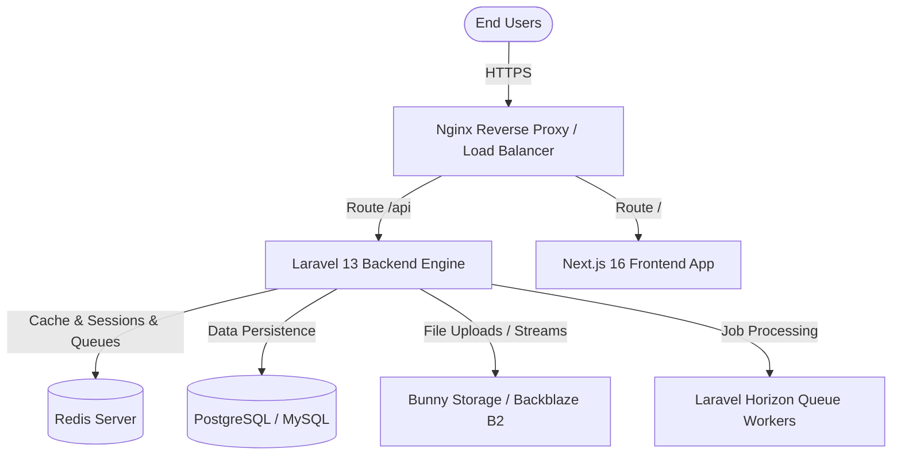

# Production Deployment Guide

This document provides a comprehensive, step-by-step guide to deploying the Educational Platform (`edu-platform`) to a production environment. It covers both the Laravel 13 backend and the Next.js 16 frontend, database migrations, queue management, storage providers, and caching strategies.

---

## Architecture Overview



---

## 1. Backend Deployment (Laravel 13)

### Server Requirements
- PHP 8.4+ (with `pdo`, `mbstring`, `openssl`, `xml`, `zip`, `gd`, `redis`, `bcmath` extensions)
- Database (PostgreSQL or MySQL)
- Redis (highly recommended for queues, session management, and caching)
- Nginx / Apache
- Supervisor (to manage queue/Horizon workers)

### Step-by-Step Backend Deploy Flow
1. **Clone the repository** and navigate to the backend folder (`src`):
   ```bash
   git clone <your-repo-url> edu-platform
   cd edu-platform/src
   ```
2. **Install Composer dependencies** (optimized for production):
   ```bash
   composer install --no-dev --optimize-autoloader
   ```
3. **Configure Environment Variables**:
   Copy `.env.example` to `.env` and fill out production credentials:
   ```bash
   cp .env.example .env
   nano .env
   ```
   *Verify the following key parameters are set for production:*
   ```env
   APP_NAME="Educational Platform"
   APP_ENV=production
   APP_DEBUG=false
   APP_URL=https://api.yourdomain.com

   # Database settings
   DB_CONNECTION=pgsql
   DB_HOST=127.0.0.1
   DB_PORT=5432
   DB_DATABASE=edu_platform_prod
   DB_USERNAME=deploy_user
   DB_PASSWORD=secure_password

   # Cache, Sessions & Queues
   CACHE_STORE=redis
   SESSION_DRIVER=redis
   QUEUE_CONNECTION=redis

   # Redis Configuration
   REDIS_HOST=127.0.0.1
   REDIS_PASSWORD=null
   REDIS_PORT=6379

   # Storage Disk (Production Setup)
   # Set default to 'b2' or 'bunny' instead of 'minio'
   FILESYSTEM_DISK=b2

   # Backblaze B2 Credential Config
   B2_KEY_ID=your_b2_key_id
   B2_APPLICATION_KEY=your_b2_application_key
   B2_BUCKET_NAME=your_b2_bucket_name
   B2_REGION=your_b2_region

   # Bunny Storage Credential Config
   BUNNY_STORAGE_ZONE=your_bunny_zone
   BUNNY_STORAGE_KEY=your_bunny_api_key
   BUNNY_STORAGE_REGION=ny # Storage Zone region code
   ```
4. **Generate Application Key** (if not already set):
   ```bash
   php artisan key:generate
   ```
5. **Run Database Migrations** (with `--force` to run safely in production):
   ```bash
   php artisan migrate --force
   ```
6. **Link Public Storage Directory**:
   ```bash
   php artisan storage:link
   ```
7. **Optimize Performance (Cache Configurations)**:
   ```bash
   php artisan config:cache
   php artisan route:cache
   php artisan view:cache
   ```

---

## 2. Queue & Process Management

The application relies heavily on background processing (e.g., ProcessVideoHLS for transcribing and converting lectures, sending notification emails).

### Option A: Laravel Horizon (Recommended)
This platform has `HorizonServiceProvider` registered. Configure and launch Horizon:
1. **Publish Horizon assets (if needed)**:
   ```bash
   php artisan horizon:install
   ```
2. **Launch Horizon**:
   ```bash
   php artisan horizon
   ```

### Option B: Supervisor Configuration
To keep Horizon or `queue:work` running continuously in the background, configure **Supervisor**:
Create a Supervisor config file at `/etc/supervisor/conf.d/edu-platform-worker.conf`:

```ini
[program:edu-platform-worker]
process_name=%(program_name)s_%(process_num)02d
command=php /var/www/edu-platform/src/artisan horizon
autostart=true
autorestart=true
user=www-data
redirect_stderr=true
stdout_logfile=/var/www/edu-platform/src/storage/logs/horizon.log
stopwaitsecs=3600
```
Update supervisor and start process:
```bash
sudo supervisorctl reread
sudo supervisorctl update
sudo supervisorctl start edu-platform-worker:*
```

---

## 3. Storage & HLS Video Processing

### Filesystem Cloud Configurations
Local storage is set up using MinIO Docker containers, but production environments must point to Bunny Storage or Backblaze B2.

- **MinIO (Local):** `ResolvesMinioUrls.php` automatically overrides standard MinIO IP endpoints dynamically to match local developer layouts.
- **Production Storage:**
  Verify that your production file drives are correctly configured inside `src/config/filesystems.php` for Backblaze B2/Bunny Storage respectively, and set `FILESYSTEM_DISK` in `.env` to the corresponding driver.

---

## 4. Frontend Deployment (Next.js 16)

The frontend is built using Next.js 16 with React 19, TailwindCSS, and Axios.

### Server Requirements
- Node.js 18.x or 20.x+
- Package Manager: `npm` or `yarn`

### Step-by-Step Frontend Deploy Flow
1. **Navigate to the frontend folder**:
   ```bash
   cd edu-platform/frontend
   ```
2. **Install Dependencies**:
   ```bash
   npm install
   ```
3. **Configure Environment Variables**:
   Create a production `.env.production` file:
   ```bash
   nano .env.production
   ```
   Define your public backend api endpoint:
   ```env
   NEXT_PUBLIC_API_URL=https://api.yourdomain.com/api
   ```
4. **Build Production Bundle**:
   This runs compile-time checks (TypeScript validation, lint checks, optimizations) and outputs a static & server-optimized `.next` build:
   ```bash
   npm run build
   ```
5. **Manage Node Server Process**:
   Use **PM2** to run the Node server in background and restart on crash:
   ```bash
   npm install -g pm2
   pm2 start npm --name "edu-platform-frontend" -- start
   ```
   Save the startup state:
   ```bash
   pm2 save
   pm2 startup
   ```

---

## 5. Reverse Proxy & SSL Configuration (Nginx)

Below is an optimized Nginx block routing requests securely to both Laravel (`/api` / `/admin`) and the Next.js frontend (`/`):

```nginx
server {
    listen 80;
    server_name yourdomain.com api.yourdomain.com;
    return 301 https://$host$request_uri;
}

server {
    listen 443 ssl http2;
    server_name yourdomain.com;

    ssl_certificate /etc/letsencrypt/live/yourdomain.com/fullchain.pem;
    ssl_certificate_key /etc/letsencrypt/live/yourdomain.com/privkey.pem;
    include /etc/letsencrypt/options-ssl-nginx.conf;
    ssl_dhparam /etc/letsencrypt/ssl-dhparams.pem;

    # Route Frontend (Next.js Server on PM2 port 3000)
    location / {
        proxy_pass http://127.0.0.1:3000;
        proxy_http_version 1.1;
        proxy_set_header Upgrade $http_upgrade;
        proxy_set_header Connection 'upgrade';
        proxy_set_header Host $host;
        proxy_cache_bypass $http_upgrade;
    }
}

server {
    listen 443 ssl http2;
    server_name api.yourdomain.com;

    ssl_certificate /etc/letsencrypt/live/yourdomain.com/fullchain.pem;
    ssl_certificate_key /etc/letsencrypt/live/yourdomain.com/privkey.pem;

    root /var/www/edu-platform/src/public;
    index index.php;

    charset utf-8;

    location / {
        try_files $uri $uri/ /index.php?$query_string;
    }

    # Pass PHP scripts to FastCGI server
    location ~ \.php$ {
        fastcgi_pass unix:/var/run/php/php8.4-fpm.sock;
        fastcgi_param SCRIPT_FILENAME $realpath_root$fastcgi_script_name;
        include fastcgi_params;
    }

    location ~ /\.(?!well-known).* {
        deny all;
    }
}
```

---

## 6. Daily / Cron Tasks

Set up Laravel Scheduler cron task to execute recurring commands (like deleting expired tokens, database optimizations):

Run the crontab editor:
```bash
crontab -e
```
Add the following line:
```cron
* * * * * cd /var/www/edu-platform/src && php artisan schedule:run >> /dev/null 2>&1
```

---

## 7. Deployment Checklist
- [ ] Application key set (`php artisan key:generate`)
- [ ] Debug mode disabled (`APP_DEBUG=false`)
- [ ] Configuration cached (`php artisan config:cache`)
- [ ] Queue supervisor worker running (`sudo supervisorctl status`)
- [ ] SSL cert active (Let's Encrypt)
- [ ] Dynamic public storage directories created and symlinked.
